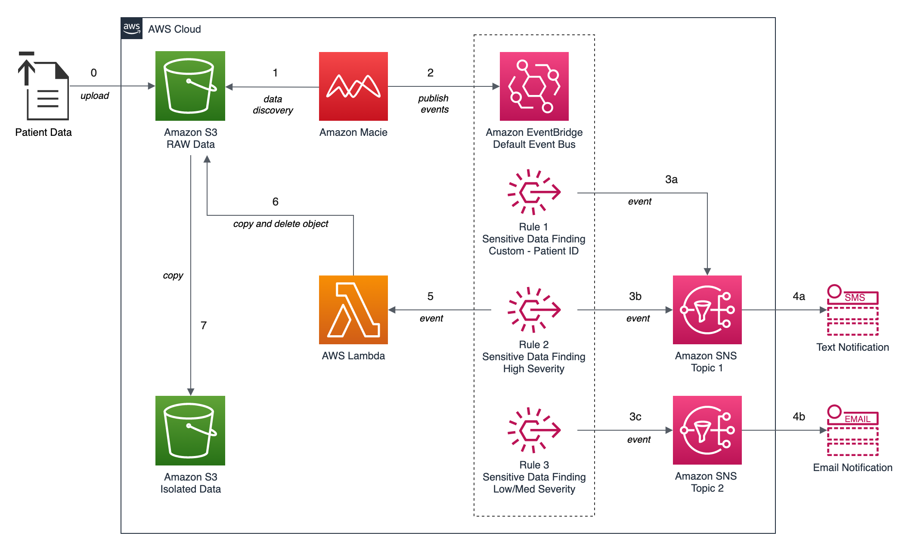

# Amazon Macie Demonstration

## Background

Source code files for a demonstration of Amazon Macie, part of the upcoming post, 'Data Lakes: Discovery, Security, and Privacy of Sensitive Data: Employing Amazon Macie to discover and protect sensitive data in your Amazon S3-based Data Lake'.

## Workflow Architecture



## Commands

```shell script
# get synthea patient data
REMOTE_FILE="synthea_sample_data_csv_apr2020.zip"

wget "https://storage.googleapis.com/synthea-public/${REMOTE_FILE}"

# alternately:
curl -O "https://storage.googleapis.com/synthea-public/${REMOTE_FILE}"

unzip -j "${REMOTE_FILE}" -d synthea_data/

# enabling macie
aws macie2 enable-macie

AWS_ACCOUNT=111222333444

aws macie2 enable-organization-admin-account \
  --admin-account-id ${AWS_ACCOUNT}

# create cloudformation stack
SNS_PHONE="+12223334444"
SNS_EMAIL="my.email.address@email.com"

aws cloudformation create-stack \
  --stack-name macie-demo \
  --template-body file://cloudformation/macie_demo.yml \
  --parameters ParameterKey=SNSTopicEndpointSms,ParameterValue=${SNS_PHONE} \
  ParameterKey=SNSTopicEndpointEmail,ParameterValue=${SNS_EMAIL} \
  --capabilities CAPABILITY_NAMED_IAM

# upload data
DATA_BUCKET=synthea-data-111222333444-us-east-1
aws s3 cp \
    synthea_data/ \
    "s3://${DATA_BUCKET}/patient_data/" \
    --recursive

aws s3 ls "s3://${DATA_BUCKET}/patient_data/"

# create classification job
aws macie2 create-classification-job --generate-cli-skeleton

# custom data identifiers
aws macie2 list-custom-data-identifiers

aws macie2 list-custom-data-identifiers | \
  jq --raw-output '.items[] | .id'

aws macie2 list-custom-data-identifiers --query 'items[*].id'

aws macie2 create-classification-job \
    --name $(echo "SyntheaPatientData_${EPOCHSECONDS}") \
    --cli-input-json file://job_specs/macie_job_specs_1x.json

aws macie2 create-classification-job \
    --cli-input-json file://job_specs/macie_job_specs_daily.json

python3 ./scripts/create_macie_job_1x.py
python3 ./scripts/create_macie_job_daily.py

# clean up
ISOLATION_BUCKET=macie-isolation-111222333444-us-east-1
aws s3 rm --recursive "s3://${ISOLATION_BUCKET}"

aws s3 rm --recursive "s3://${DATA_BUCKET}"

aws cloudformation delete-stack --stack-name macie-demo
```